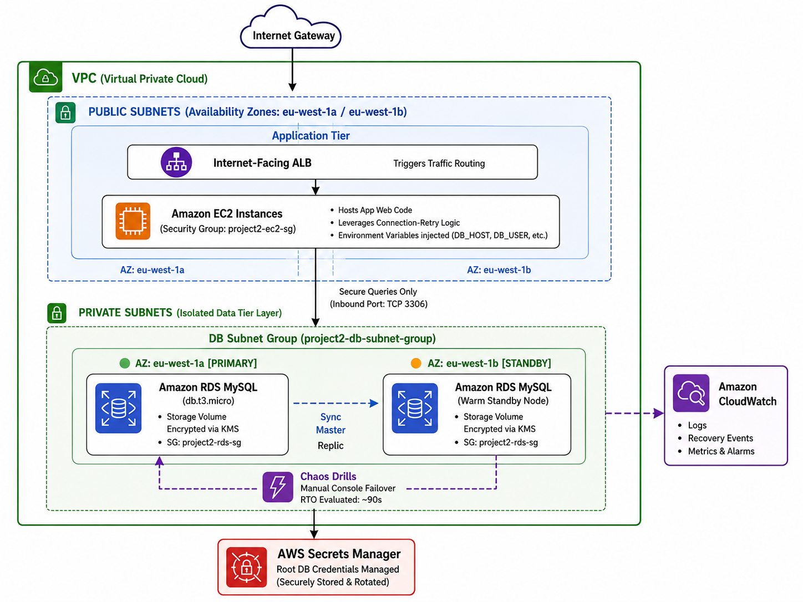

# AWS Cloud Databases — Production & Validation Labs

## 📌 Architectural Overview

This week's focus centered on architecting, securing, and validating cloud database infrastructures within Amazon Web Services (AWS). The labs covered relational deployments using **Amazon RDS (MySQL)**, highly scalable distributed document engines via **Amazon Aurora**, and low-latency serverless options with **Amazon DynamoDB**. 

The primary deliverable involved deploying a resilient, production-grade 3-tier database architecture isolated from the public internet, configuring secure identity-based firewalls, and conducting chaos validation drills to evaluate live high-availability failovers.

---
## Architecture 

<p align="center">
  
</p>


---
## 🧠 Core Technical Learning Objectives

### 1. Relational Database Service (RDS) Engine Patterns
* **Multi-AZ Deployments:** Positioned strictly for **High Availability (HA) and Disaster Recovery (DR)**. Synchronously replicates storage data at the block layer to a warm standby instance in an independent Availability Zone. AWS handles automatic failover by updating the instance's canonical DNS endpoint.
* **Read Replicas:** Built for **horizontal read-scaling** and reducing load on the primary write instance. Utilizes *asynchronous* replication and cannot be utilized as a direct automated high-availability failover target.
* **Amazon Aurora:** A cloud-native, fully managed relational engine providing up to 5x the performance baseline of standard MySQL. Executes continuous **6-way data replication across 3 distinct Availability Zones** natively.

### 2. Network Isolation & Security Hardening
* **Subnet Group Layouts:** Database instances must be tied to an RDS DB Subnet Group spanning at least **2 private subnets** mapped to different Availability Zones. Public internet routes are completely blocked (`Public Access: NO`).
* **Security Group Chaining:** Access over database ingress ports (e.g., TCP 3306 for MySQL) must be strictly restricted by nesting the **Security Group ID** of the computing application tier (`project2-ec2-sg`) as the explicit source, preventing exposure to broad CIDR ranges (`0.0.0.0/0`).
* **Cryptographic Profiles:** Data encryption at rest must be initialized at launch utilizing an AWS KMS Customer Managed Key. Existing unencrypted deployments require snapshot generation, encrypted copying, and instance restoration to apply encryption parameters post-launch.

### 3. Serverless NoSQL (Amazon DynamoDB)
* **Performance Scaling:** Fully managed NoSQL key-value and document database delivering single-digit millisecond response latencies at massive scale.
* **Capacity Strategies:** **Provisioned Mode** enforces static Read/Write Capacity Units (RCUs/WCUs) for predictable budgets, while **On-Demand Mode** automatically scales request capacity to absorb highly spiky workloads.
* **Advanced Features:** Utilizes **DynamoDB Streams** to capture mutations and trigger serverless logic, **DAX** for microsecond caching, and **Global Tables** for active-active multi-region replication.

---

## 🛠️ Practical Tasks & Implementations Executed

### Task 1: Provisioning a Secure RDS MySQL Instance
Deployed an isolated relational database tier within a custom VPC infrastructure following these steps:

1. **Created DB Subnet Group:** Initialized `project2-db-subnet-group` mapping exclusively across two distinct private subnets (`eu-west-1a` and `eu-west-1b`).
2. **Configured Inbound Access Firewalls:** Configured `project2-rds-sg` to drop all traffic except inbound queries on `TCP Port 3306`, setting the source explicitly to the application tier's security group ID.
3. **Launched Database Engine:** Provisioned a Free Tier eligible `db.t3.micro` MySQL instance:
   * Enabled **Multi-AZ deployment**.
   * Set public access availability to **NO**.
   * Forced data volume encryption via default AWS KMS keys.
   * Offloaded administrative root credentials storage directly to **AWS Secrets Manager**.

### Task 2: Connecting the Compute Tier App
Integrated a Python/Node.js backend environment to the newly provisioned secure database layer:
* Ran port verification handshakes directly from the computing instance using network tools:
```bash
  nc -zv project2db.xxxx.eu-west-1.rds.amazonaws.com 3306
